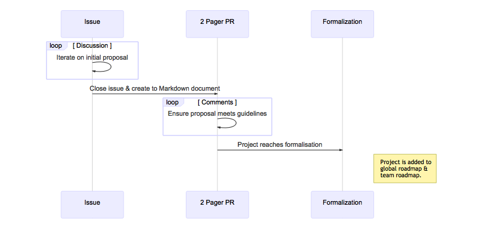

# Project Roadmap

This is a simple framework I'm iterating on, to facilitate a nice project submission -> discussion -> formalisation -> roadmap cycle.

In order to facilitate a free-flow of ideas, and rapid iteration, I prefer the usage of tools that developers would generally prefer suchas *GitHub* instead of having to spend time in *Confluence*, *Jira*, *Wiki's*, *eMail* etc when attempting to formulate a project idea.

The collabrative nature of Git, and by extension the tools built on top of it in GitHub, make it a natural fit for me to ideate and formalise project plans.

### tl;dr

1. Open an issue, and add relevant tags and reviewers
2. Discuss until consensus reached to go ahead
3. Create a 2 Pager to discuss further
4. Add to the roadmap

Read the [Contribution Guidelines](CONTRIBUTING.md) for a deeper explanation of the process flow.
